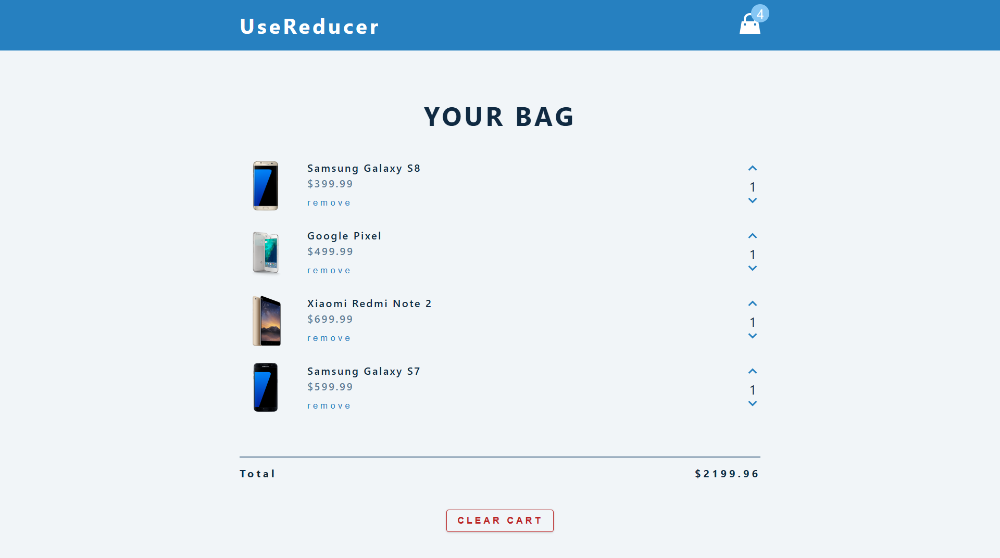
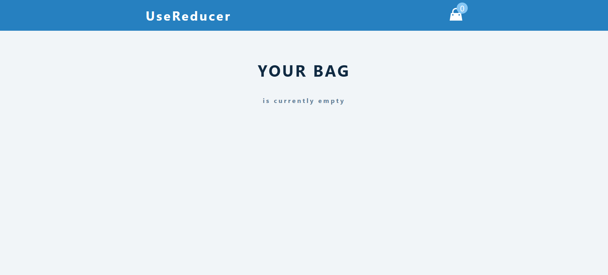
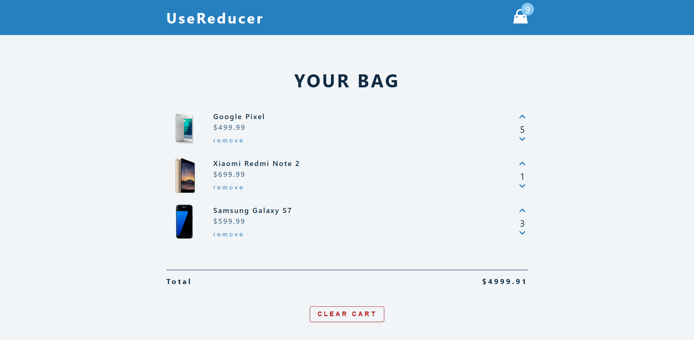

# React JS Cart

A dynamic and responsive shopping cart application built using React. This project demonstrates modern front-end development practices, including state management, component-based architecture, and persistent data storage.

## Screenshots

| Home Screen | Product Details | Cart View | Loading Screen |
| :---: | :---: | :---: | :---: |
|  |  |  |  |

## Features

- **Product Catalog**: Browse a wide range of products with detailed descriptions and images.
- **Dynamic Cart**: Add, remove, and update item quantities with real-time price calculations.
- **Persistent Storage**: Cart state is saved to `localStorage`, ensuring data persists across page reloads.
- **Responsive Design**: Optimized for mobile, tablet, and desktop viewing.
- **Interactive UI**: Smooth transitions and instant feedback on user actions.

## Tech Stack

- **Frontend**: React.js (Hooks, Context API)
- **Styling**: CSS Modules / Styled Components
- **State Management**: React Context API
- **Icons**: FontAwesome / React Icons
- **Deployment**: Vercel / Netlify

## Getting Started

### Prerequisites

- **Node.js**: v14.x or higher
- **npm**: v6.x or higher (or yarn/pnpm)

### Installation

1. Clone the repository:
   ```bash
   git clone https://github.com/yourusername/react-js-cart.git
   cd react-js-cart
   ```

2. Install dependencies:
   ```bash
   npm install
   ```

3. Start the development server:
   ```bash
   npm start
   ```
   The application will be available at `http://localhost:3000`.

## Project Structure

```text
src/
├── components/     # Reusable UI components
├── context/        # State management logic
├── data/           # Mock product data
├── hooks/          # Custom React hooks
├── pages/          # Main application views
└── styles/         # Global and component-specific styles
```

## Contributing

Contributions are welcome! Please follow these steps:
1. Fork the project.
2. Create your feature branch (`git checkout -b feature/AmazingFeature`).
3. Commit your changes (`git commit -m 'Add some AmazingFeature'`).
4. Push to the branch (`git push origin feature/AmazingFeature`).
5. Open a Pull Request.

## License

Distributed under the MIT License. See `LICENSE` for more information.